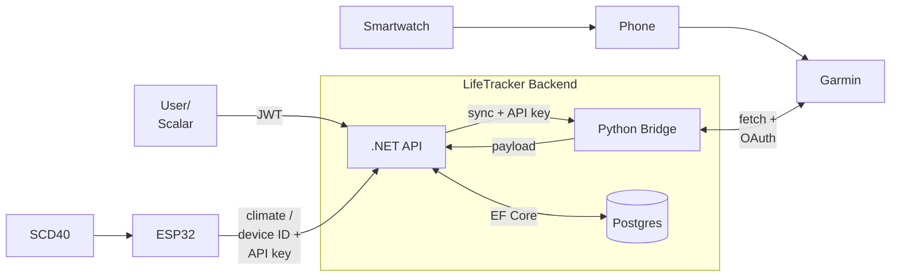

# LifeTracker

LifeTracker is a very specific personal insight and analytics platform designed to uncover interesting long term correlations across varying life data streams.

Instead of leaving personal data and metrics locked inside separate isolated "walled gardens" (smartwatch biometrics, smart home sensors, desktop activity tracking, and hardware monitors), LifeTracker unifies everything under custom database ownership to draw meaningful and interesting insights over long periods of time.

## The Core Goal: Finding Long-Term Correlations & Insights

Data collection is just step one. The real power comes from combining long-term datasets to analyze how different aspects of daily life interact, here's some examples of the initial plan:

- **Environment, Exercise & Sleep:** How room climate measurements (ESP32 with SCD40 sensor), local weather (Buienradar) and periods of regular vs less/to no exercise directly impact sleep quality and HRV.

- **Stress & Physical State:** How staying up late or changing exercise frequency can impact baseline resting heart rate over weeks or months.

- **Activity & Physiology:** Correlating desktop usage (ActivityWatch) or competitive gaming performance (e.g., *Deadlock*, *League of Legends*) with real-time biometric spikes to quantify stress during specific matches and how your performance could alter those results, such as a bad frustrating loss vs a hard fought win.

- **Hardware, Climate & Software Workloads:** Tracking how the weather and differing seasons combined with desktop activity like idling, heavy development environments or extensive gaming sessions directly impact hardware performance and metrics such as temps, voltages and CPU/GPU usage. Since as far as im aware no real hardware monitor exists that actually combines your specific desktop activity, so this would bridge another common gap between different applications and data sets. Also seeing how long term heavy load could affect room temperature would be interesting.

> [!IMPORTANT]
> **For Reviewers:** This is a **personal** stack built around specific hardware, accounts, and live data streams. Because it is designed solely for a single-user(as of now), reviewers will not have a matching Garmin watch, ActivityWatch instance, or physical ESP32 with climate sensor.
However by default the repository runs in **Demo Mode**, prefills a **JWT Bearer** token and comes with a database that gets seeded with records on first launch(as of now just Garmin records since those are the most extensive routes). You can spin up the stack very easily with `docker compose up --build -d` and open http://localhost:5071/scalar to explore the OpenAPI documented routes in Scalar and test all Garmin `GET` & Buienradar endpoints without anything else required.
> Also everything is **still HTTP instead of HTTPS** since it's still local development and i haven't setup Azure deployment yet.

# System Architecture



Smartwatch → phone → Garmin is independent. The .NET API only talks to Garmin through the Python Bridge(using the unofficial `garminconnect` library) and only on `POST /sync/*`. GETs read Postgres.

## Stack

| Component       | What it is                                                                                                                    |
|-----------------|-------------------------------------------------------------------------------------------------------------------------------|
| LifeTracker API | ASP.NET 10 Core Web API(Minimal APIs), JWT for Auth, OpenAPI / Scalar with prefilled JWT Bearer for dev and demo              |
| PostgreSQL 16   | Centralized database, golden record of all the different integrations and data sets. EF Core + migrate-on-boot                |
| Garmin bridge   | Python FastAPI + `garminconnect`(unofficial library). Tokens on a Docker volume. Shared API key for Auth with the .NET client |
| ESP32 + SCD40   | Pushes CO₂ / temp / humidity to `POST /api/room-climate`                                                                      |
| ActivityWatch   | Desktop activity tracker integration from your/user's local AW server                                                         |
| Buienradar      | Pulls and stores feed of the Heino weather station (hardcoded for now)                                                        |
| GitHub Actions  | CI with `dotnet restore` / `build` / `test` on push                                                                           |

Compose runs **API + Postgres**. The bridge is a Compose **profile** (`garmin`), not part of the default Demo stack. Port **9002 is not published** on the default compose file; the API reaches the bridge on the Docker network. `docker-compose.override.yml` is for local poking at the sidecar.

## Quick start

```bash
docker compose up --build -d
```

After automatic migrate + Demo seed:

| | |
| --- | --- |
| API | http://localhost:5071 |
| Scalar | http://localhost:5071/scalar |
| Health | http://localhost:5071/health |

Default compose env is **Demo**: Scalar has a Bearer token already, Garmin tables get seed data, ActivityWatch and room-climate ingest return 503.

### Live Garmin (optional):
Need Garmin account with actual data from a Garmin Smartwatch
```bash
cp LifeTracker/Bridges/garmin_bridge/.env.example LifeTracker/Bridges/garmin_bridge/.env
# GARMIN_EMAIL / GARMIN_PASSWORD
docker compose --profile garmin up --build -d
```

Bridge health is then on the container network (`http://garmin_bridge:9002/garmin/health`). Only bind 9002 on the host if you use the override file.

Run the API from Visual Studio: start `db` (and the bridge profile if you need sync), set `JWT:Key` / `JWT:Password` in user secrets. `appsettings.json` leaves them empty on purpose.

## Auth

| Who                             | How                                                                                                                                               |
|---------------------------------|---------------------------------------------------------------------------------------------------------------------------------------------------|
| User / Scalar                   | JWT. Already prefilled by default for demo and local dev, otherwise `POST /api/auth/token` with `{ "password": "<JWT:Password>" }`                |
| .NET → Python bridge            | Shared API key (`GarminBridge__ApiKey` / `GARMIN_BRIDGE_API_KEY`)                                                                                 
| ESP32                           | `X-Device-ID` + `X-API-Key` (no JWT).                                                                                                             | |
| Anonymous / Unauthorized routes | `/`, `/health`, OpenAPI / Scalar, `POST /api/auth/token`, `POST /api/room-climate` (device headers with `X-Device-ID` + `X-API-Key` required) |

## HTTP surface

> [!IMPORTANT]
> No **HTTPS** and production environment setup yet.

`date` query is `yyyy-MM-dd`, defaults to today, future / garbage → 400 (`DateQueryMiddleware`(for param binding) & `DateQueryFilter`). Missing row → 204. Bridge down on sync → 503.

**Garmin GETs are from applications own database**

| Method | Path |
| --- | --- |
| GET | `/api/garmin/heartrate` |
| GET | `/api/garmin/stress` |
| GET | `/api/garmin/sleep` |
| GET | `/api/garmin/day` (HR + stress required, sleep optional) |
| GET | `/api/garmin/all` |
| POST | `/api/garmin/sync/heartrate` |
| POST | `/api/garmin/sync/stress` |
| POST | `/api/garmin/sync/sleep` |
| POST | `/api/garmin/sync/day` |
| POST | `/api/garmin/sync/backfill?days=14` |

Dated(date param) Garmin endpoints use a neat shared routing abstraction pipeline (`DateQueryFilter` + `MapGarminGet` / `MapGarminPost`(with `EnsureBridgeAvailable` as well)) to eliminate a lot of boilerplate handler duplication.

`GarminDay` is a composite / response type, not a table. Heart / stress / sleep are separate rows joined on `Date`.

**Everything else**

| Method | Path | Notes |
| --- | --- | --- |
| GET/POST | `/api/buienradar` | GET from DB, POST pulls the feed |
| POST | `/api/room-climate` | ESP32 ingest |
| GET/POST | `/api/activity-watch` | GET from DB; `POST /sync/all` and `/sync/new` need local AW |

Complete overview of all routes with OpenAPI documentation are in Scalar.

## Project Structure

```text
LifeTracker.slnx
docker-compose.yml
docker-compose.override.yml          # local-only; host-bind the bridge
├── LifeTracker/                     # .NET 10 API
│   ├── Endpoints/                   # Minimal API groups + Garmin route helpers
│   ├── Filters/                     # DateQueryFilter, DeviceKeyFilter
│   ├── DTOs/                        # Data Transfer Objects shaping external API payloads
│   ├── Entities/                    # EF Core database models mapped to PostgreSQL
│   ├── Services/                    # Core business and persistence logic
│   ├── Bridges/
│   │   ├── garmin_bridge/           # Python FastAPI bridge/sidecar
│   │   └── ESP32RoomClimate/        # C++ .ino firmware + secrets.example
│   └── Dockerfile
└── LifeTracker.Tests/               # WebApplicationFactory + mapper/persistence tests
```

## DTOs vs entities (on purpose)

Typical REST practice is to split **request/response DTOs** from **EF entities** so the public JSON never is the database row. LifeTracker does the opposite for **outbound** data, on purpose.

| Type | Role |
| --- | --- |
| **DTO** (`LifeTracker/DTOs`) | *Their* JSON. Garmin Connect, Buienradar feed, ActivityWatch. Field names and nulls we don't control. Used only while ingesting/mapping. |
| **Entity** (`LifeTracker/Entities`) | *Our* golden record: trimmed, named, and typed the way it is stored. GET routes return these. Scalar's schemas are those types serialized to JSON. |


## Tests

```bash
dotnet test LifeTracker.slnx
```

CI runs the same. Integration tests use `WebApplicationFactory`: in-memory EF, test JWT, stub `HttpMessageHandler` for the bridge. Persistence tests do not call Garmin. There is a live ish Buienradar check.

Coverage is not “every status on every route.” GET `/garmin/heartrate` is the date/auth matrix; sync has a first POST test; more routes should go on a shared smoke list rather than cloned suites.

Still more tests to be written.

## Config

| What | Where |
| --- | --- |
| Postgres | compose / `ConnectionStrings__DefaultConnection` |
| JWT | `JWT__Key`, `JWT__Issuer`, `JWT__Audience`, `JWT__Password` |
| Bridge URL + key | `APIs__GarminConnect`, `GarminBridge__ApiKey` |
| Garmin login | `LifeTracker/Bridges/garmin_bridge/.env` (gitignored). Tokens: `garmin_tokens` volume |
| ESP32 | `ESP32__DeviceID`, `ESP32__APIkey` (names follow the options class) |

Compose Demo values are placeholders. Do not reuse them on a public host.

## Acknowledgements & Slight Roadmap

- Everything is still HTTP since it's still mostly local development and i haven't setup Azure deployment yet.

- Timezones aren't properly aligned in every spot yet, need to do a proper overhaul and check for every component there.(WIP)

- Currently no frontend exists yet but it's planned, Vue or React with Grafana dashboards and such.

I've just been using the OpenAPI Scalar UI page to check and test all my routes, and looking in my DB to see what's going on but it's also planned.

Currently the state of the application has mostly been integrating all these different data sources and not creating any novel data or insights with it yet. But that will all increase over time, the first basic example of actual new data/info created from the gathered API data is the awake window.

Garmin itself doesn't store or calculate that data, it's not in their API but obviously it can all be inferred just using the sleep start and end times.

Next: Aligning timezones across the board, simple awake duration calculation from sleep start/end times, basic frontend with some Grafana charts

Unit tests and CI should and need to be more extensive, most existing ones are focused on Garmin right now, those can still use a lot extra but other components need more or their first tests as well

Setting up Azure environment so ESP32 can ingest room climate data 24/7, for more proper automated background services for the other components and for setting up and testing out production environment


Still local HTTP. Azure App Service + Postgres is the next visible slice (HTTPS, ESP32 can post when the PC is off). No frontend yet; Scalar is the UI. Awake-window from sleep start/end is the first derived metric on the list. Timezones are not consistent everywhere — that is what `AppClock` is for.

Very specific personal platform, not a product. Unofficial Garmin API, personal hardware, rate limits if you hammer sync. Demo compose is the supported reviewer path.
```
